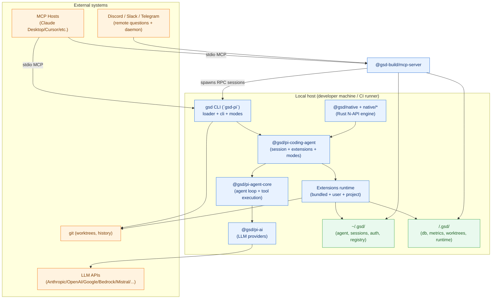
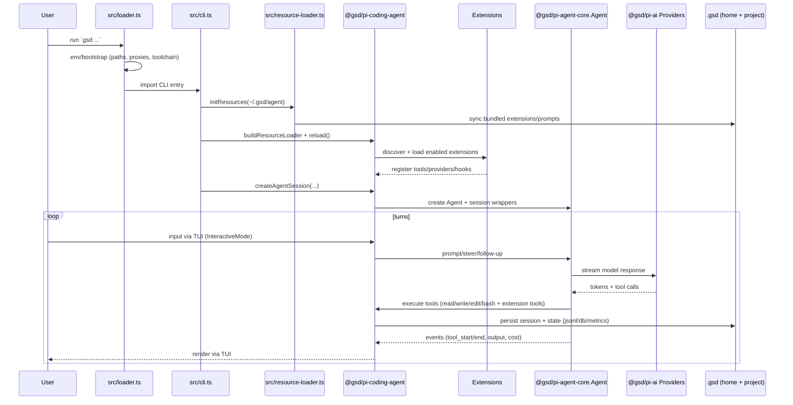
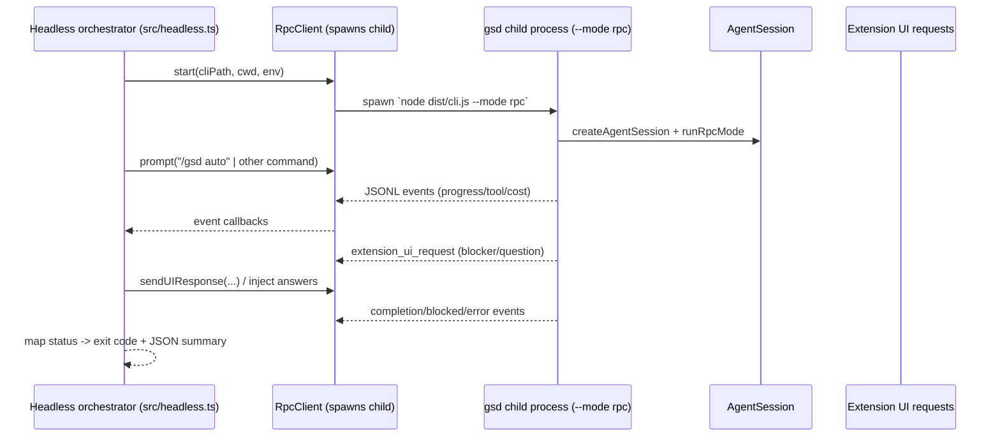
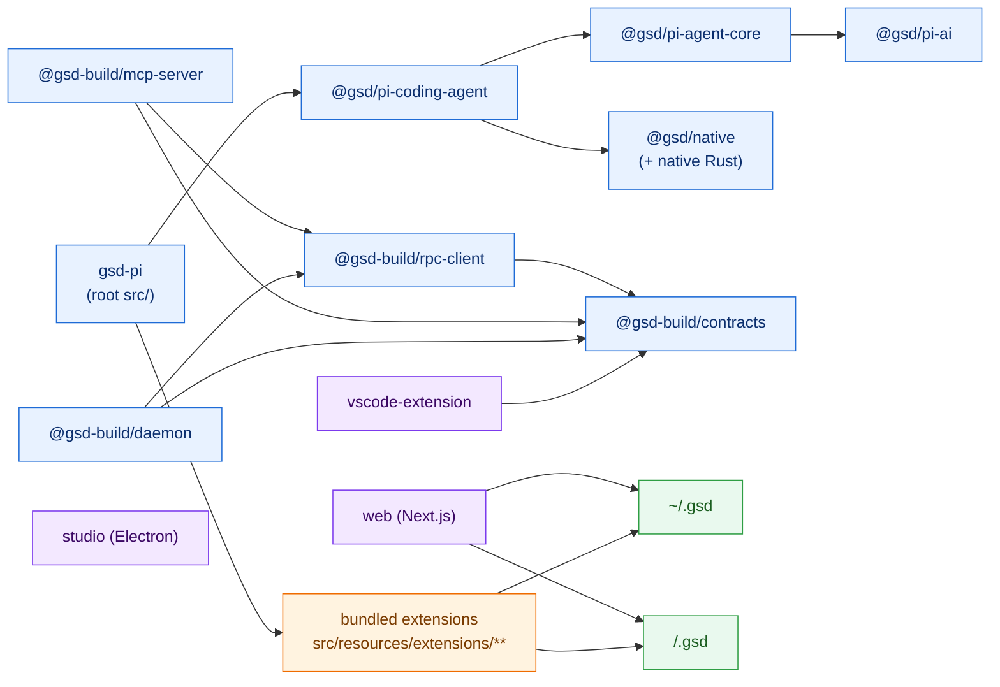
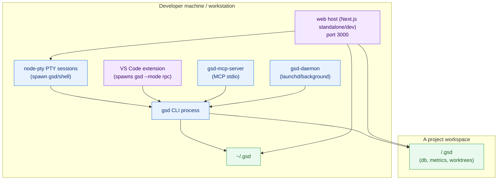

# Architecture Overview

This repo builds **GSD (Get Shit Done)**: a local-first coding agent with multiple “surfaces” (CLI/TUI, headless automation, MCP integration, web UI, VS Code extension) backed by a shared agent core, extension system, and persistent project state.

## 1) High-level architecture

- **`gsd-pi` (root `src/`)**: product wrapper around the upstream “pi” agent; owns startup loader (`src/loader.ts`), resource syncing (`src/resource-loader.ts`), onboarding (`src/onboarding.ts`), web-mode launcher (`src/web-mode.ts`), and a CLI facade (`src/cli.ts`) that selects modes.
- **`@gsd/pi-coding-agent` (`packages/pi-coding-agent/`)**: the main SDK/engine used by `gsd-pi` to create sessions, load extensions/resources, manage settings/models, and run interactive/print/RPC modes.
- **`@gsd/pi-agent-core` (`packages/pi-agent-core/`)**: the generic agent loop: streams model responses, executes tool calls, emits events, and handles retries/cancellation.
- **`@gsd/pi-ai` (`packages/pi-ai/`)**: provider-agnostic LLM layer (Anthropic/OpenAI/Google/AWS Bedrock/Mistral + compat transports).
- **Extension system (bundled + user/project)**: extensions are discovered, enabled/disabled via a registry, and loaded into a runtime that can register tools, models/providers, commands, and hooks.
  - Bundled extensions live under `src/resources/extensions/**` and are synced into `~/.gsd/agent/extensions/**` at startup.
  - The **`gsd` extension** (`src/resources/extensions/gsd/**`) provides most “GSD workflow” behavior: worktrees, milestones/slices/tasks, SQLite-backed state, metrics, automation phases, and operator commands.
- **RPC + contracts (`@gsd-build/contracts`, `@gsd-build/rpc-client`)**: JSONL-over-stdio protocol for driving an agent session as a child process.
- **MCP integration**
  - **In-process MCP mode**: `gsd --mode mcp` starts an MCP server exposing the session’s tool registry (`src/mcp-server.ts`).
  - **Standalone MCP server package**: `@gsd-build/mcp-server` exposes higher-level “orchestration + state readers + workflow tools” over MCP (`packages/mcp-server/`).
- **Daemon (`@gsd-build/daemon`)**: long-running background orchestrator for project monitoring and Discord integration (`packages/daemon/`).
- **Web UI (`web/`)**: Next.js app that can spawn `gsd` in a PTY for a browser terminal and manage local `.gsd` files via API routes.
- **VS Code extension (`vscode-extension/`)**: spawns `gsd --mode rpc` and bridges agent events + UI prompts into VS Code.
- **Native engine (`@gsd/native` + `native/`)**: Rust N-API module (`@gsd-build/engine-*` optional deps) for high-performance utilities (grep/glob/diff/parser/highlight/image/etc.).

## 2) Data flow

### Interactive CLI (TUI) lifecycle

### Headless orchestration (`gsd headless`)

`src/headless.ts` spawns a **child** `gsd --mode rpc` process and drives it via JSONL RPC, auto-handling extension UI requests (questions/confirmations) and emitting machine-readable summaries/exit codes.

### MCP server modes

- **`gsd --mode mcp`**: exposes *the current session’s tool registry* over MCP stdio (`src/mcp-server.ts`).
- **`gsd-mcp-server` (`@gsd-build/mcp-server`)**: exposes *orchestration + state readers + workflow tools* and typically spawns/controls sessions via RPC (`packages/mcp-server/src/server.ts`).

## 3) Component dependencies

## 4) External integrations

- **LLM providers** (via `@gsd/pi-ai`): Anthropic, OpenAI (Responses/Completions + Codex), Google (Gemini/Vertex), AWS Bedrock, Mistral, plus “OpenAI-compatible” endpoints.
- **MCP** (via `@modelcontextprotocol/sdk`): stdio servers for external hosts (Claude Desktop/Cursor/etc.).
- **git**: required at startup; used heavily for worktree creation/merge/cleanup and repo identity.
- **Remote questions + notifications**: Slack/Discord/Telegram adapters (bundled extension + standalone adapter in `@gsd-build/mcp-server`).
- **Discord daemon**: `@gsd-build/daemon` uses `discord.js` and can run an LLM-backed orchestrator from a control channel.
- **Containerization**: `docker/` provides a sandbox runtime (compose + Docker Sandbox template) and maps port `3000` for the web UI.
- **Native binaries / optional deps**: platform-specific `@gsd-build/engine-*` provide Rust N-API modules; JS fallbacks exist for some features.

## 5) Deployment topology

## 6) Key abstractions

- **`Agent` (`packages/pi-agent-core/src/agent.ts`)**: stateful controller over the streaming loop; owns model/tool state, queues steering/follow-ups, cancellation, and event emission.
- **`agentLoop` (`packages/pi-agent-core/src/agent-loop.ts`)**: the turn engine; streams provider output, validates/executes tool calls (sequential/parallel), and produces structured events.
- **`AgentSession` (`packages/pi-coding-agent/src/core/agent-session.ts`)**: session wrapper around `Agent` that adds persistence (JSONL), extension integration, tool registry activation, and UI-mode coordination.
- **`ModelRegistry` + `SettingsManager` (`packages/pi-coding-agent/src/core/*`)**: resolves available models/providers and merges settings from global + project scopes.
- **`ResourceLoader` / `DefaultResourceLoader`**: loads bundled/user/project resources and drives extension discovery/loading; `gsd-pi` syncs bundled resources into `~/.gsd/agent` before reload.
- **Extension runtime (`packages/pi-coding-agent/src/core/extensions/*`)**: registers tools/commands/hooks; can also register provider/model configs before session creation (flushed into `ModelRegistry`).
- **RPC protocol (`@gsd-build/contracts`)**: JSONL framing for commands/events between hosts (VS Code/web/headless/MCP server) and a `gsd --mode rpc` child process.
- **Project state layer (bundled `gsd` extension)**: SQLite + JSON artifacts under `<project>/.gsd` to track milestones/slices/tasks, metrics, worktrees, and recovery/forensics signals.

